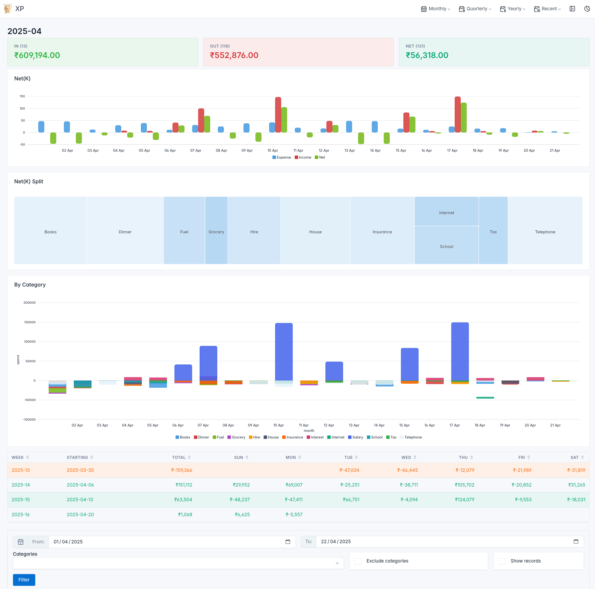

## XP

Is a personal expense dashboard viewer built using [SQLPage](https://sql-page.com/ "SQLPage"). It assumes data is in a single table called `expense` in a sqlite3 database (see `sample/migrations/01_create_schema.sql`).



### Features

- A dynamic menu is built using the data available in the database to provide queries by various date ranges like recent months, quarters, financial years etc. By default, current month is shown. See `shell.sql`.
- Various data summarization for a given search/filter is available as tables and graphs.You can also choose to show individual records. See `search_results.sql`.
- A search form pre-filled with current filter is there at the bottom. It also has an option to multi-select categories of expenses to further filter down. You can also exclude selected categories. See `search_form.sql`.

### Getting started

- Clone this repository
- Install `sqlpage.bin` somewhere.
- Run `sqlpage.bin -d ./sample`. This should create an empty sqlpage.db and run migrations to create schema.
- Navigate to http://localhost:8080/ - you should see an empty dashboard.
- Go to http://localhost:8080/csv_import.sql and load _sample/sample.csv_.
- Once it is done, you should have 10K records in the database. You can now explore the dasboard via menus.
- If you want to create a larger sample, see `sample/gensamplecsv.py`. It requires _pandas_ and _faker_ as dependencies and will - overwrite _sample.csv_. So, better to copy the python script somewhere else and edit it and then run it.

### Using your own data

- Create CSV file like given in the sample, with your own data. Either use the web interface for importing CSV as above or make your own that does not delete existing data if you prefer appending new ones periodically.
- Best is to create a new `personal.json` config file that points to your own `personal.db` file like below.
  ```json
  {
    "database_url": "sqlite://./personal.db?mode=rwc"
  }
  ```

You can then run using this database as

  ```shell
  sqlpage.bin -c personal.json
  ```

### Notable stuff

- There is no security. It is supposed to be used by you on your local machine. Ensure there is a firewall!
- If you want security for such websites, say for internal use, my go to solution has been using nginx and [oauth_proxy](https://github.com/oauth2-proxy/oauth2-proxy) in the front.
- `search_results.sql` used to be written using CTEs for each query. I changed this to a temporary table to reduce query code size and to act as a cache. Since temporary tables are specific to sessions, it shouldn't collide with other parallel users.
- `search_results.sql` has examples of presenting  your daily numbers wrapped by weeks similar to github contribution graph. Similarly, `shell.sql` has SQL for generating various date ranges. Could be interesting since both these come up often when building dashboards.
- Some columns in the db are pre-computed and loaded, but not used at the moment. I added these for some future  ideas I have.
- I've hard coded Indian Rupee (₹) as the currency and formatted it using `printf()` because Indian formatting is different from thousands/millions. SQLPage currently formats according to that convention even when currency is specified as Indian Rupee (_INR_).

### Credits

- Favicon was generated using [Grok 3](https://grok.com), then removed background using [remove bg](https://www.remove.bg/upload) and converted using [favicon.ico](https://favicon.io/).
- [SQLite](https://sqlite.org/) for a phenomenal database engine.
- [SQLPage community](https://github.com/sqlpage/SQLPage/discussions) for very useful discussions.

